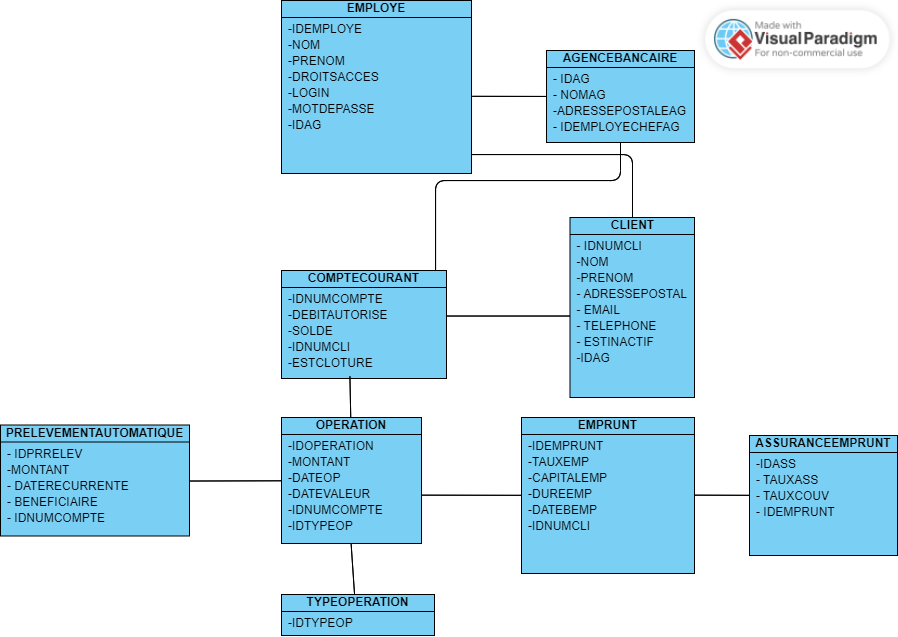
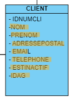
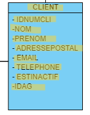
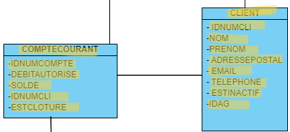
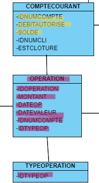
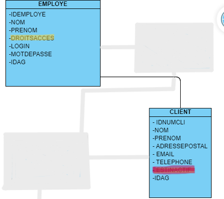

# Document Technique de Daily Bank V0

Equipe:

* Fligitter Robin -- Redacteur 
* Brefuel Mathis
* Planques Maxime
* Nichele Angelo 

La documentation technique est un document à destination des programmeurs en charge de la maintenance de l’application. 
Elle décrit l’ensemble de l’application développée dans la version 0.
Elle décrit les fonctionnalités développées.

# Sommaire 

** Presentation de l'Application
  * Use Case Global
  * diagramme de classe
** Architecture
  * Architecture générale
  * Ressources externes
  * Structuration des packages
  * Eléments essentiels
** Fonctionnalités
  * Modifier les information clients
  * Créer un nouveau client
  * Consulter un compte
  * Debiter un compte
  * Rendre inactif un client
  
# Présentation de l'application

L'application Daily Bank est l'outil de gestion de comptes des clients et en raison d'un besoin de restructuration des services banquaires nous allons développer cette application devenue obsolète. Nous allons alors adapter cette application aux nouveaux besoin de la banque.

## Use Case Global

Le *Guichetier* est le rôle centrale de l'application, il représente l'employé lambda de gestion des clients, il a accès aux fonctionnalités basiques de la gestion des clients et des comptes.

* Modifier les infos clients
* Créer un nouveau client
* Consulter un compte
* Débiter un compte 

Le *Chef d'Agence* représente le supérieur du guichetier, il a accès à toutes les fonctionnalités du guichetier et d'autre fonctionnalités propre à son rôle.

* Modifier les infos clients
* Créer un nouveau client
* Consulter un compte
* Débiter un compte 
* *Rendre Inactif un client*

## Diagramme de classe

Voici le diagramme de classe de données globale de la base de données

* ' EMPLOYE ': représente les employés de la banque, qui ont des login et des droits d'accès différents selon si ils sont chef d'agence ou pas (DROITSACCES).
* ' AGENCEBANCAIRE' : represente une agence constitué du nom de l'agence, de son adresse, d'un id et d'un chef d'agence représenté par une ID ( IDEMPLOYECHEFAG ).
* ' CLIENT ' : représente le client avec toutes ses information personnelles ainsi que son agence ( IDAG ) et son statut d'inactivité ( ESTINACTIF ).
* ' COMPTECOURANT ' : représente les comptes avec le numéro du compte, le debit autorisé, la solde, le numéro du client auquel appartient le compte ( IDNUMCLI ), et son statut ( cloturé ou pas -- ESTCLOTURE )
* ' OPERATION ' : représente une operation opéré sur un compte, on y retrouve l'id de celle ci, le montant, la date ( DATEOP et DATEVALEUR ), le numero du compte ainsi que le type d'opération ( IDTYPEOP) 
* ' TYPEOPERATION ' liste tous les type d'OPERATION 
* ' EMMPRUNT ' : represente les informations lors d'un emprunt, comme le un identifiant, le taux, le montant, la durée, le debut et le client.
* ' ASSURANCEEMPRUNT ' : représente l'assurance de l'emprunt avec l'identifiant, le taux, le taux couvert et l'emprunt concerné.
* ' PRELEVEMENTAUTOMATIQUE ' : représente les prelevements automatiques, on y retouve un identifiant, le montant, les dates recurrentes, les benéficiares et le compte prelevé.

# Architecture

## Structuration des packages 
Les packages : dans src/main/java

*** application

  ** DailyBank : main() de départ

*** application.control

  ** Contrôleurs de dialogue et accès aux données : gestion des fonctions de l’application. Deux rôles majeurs :

    * Réalise les actions concrètes : accès BD, faire un calcul complexe, générer un fichier, …​

    * Ouvre les autres fenêtres nécessaires : gestion du dialogue.

*** application.view

   ** Contrôleurs associés aux vues fxml.

    * Gestion de la vue affichée : contrôle des saisies réalisées, messages d’erreurs pour les contrôles de surface, appel du contrôleur de dialogue pour réaliser les actions concrètes.

*** application.tools

  ** Utilitaires pour application.view et application.control

*** model.data

  ** Classes java mappant les table de la BD. Une table ⇒ 1 classe. On peut en ajouter (classes pour jointures, …​)

*** model.orm

  ** Classes d’accès physiques à la BD. Une table ⇒ 1 classe offrant différentes méthodes pour accéder à la table : select, insert, delete, update, appel de procédure stockée (elles sont données). On peut en ajouter.

*** model.exception

  ** Classes des exceptions spécifiques d’accès à la BD, levées par les classes de model.orm

Les views fxml : dans src/main/resources.

*** application.view

  ** Vues de l’application : fichiers fxml

  ** Fichier css
  
## Rôle de chaque classe dans les packages

*** application

** DailyBank : main() de l’application

** DailyBankState : classe de description du contexte courant de l’application : qui est connecté ? est-il chef d’agence ? à quelle agence bancaire appartient-il ?

*** application.control

** Une classe par fenêtre dite contrôleur de dialogue. Exemple LoginDialog

** Rôles de chaque classe :

* A la création : i) construit le Stage java FX de la fenêtre, ii) charge le fichier fxml de la vue et son contrôleur

* Offre une méthode de démarrage du Dialogue, du type doNomClasseControlDialog(...). Exemple doLoginDialog()

* Offre des méthodes d’accès aux données, disponibles pour son contrôleur de vue

* Offre des méthodes d’activation d’autres fenêtres, disponibles pour son contrôleur de vue

* Peut offrir des méthodes de calcul ou autre (accès à des fichiers, …​), disponibles pour son contrôleur de vue

*** application.view

** Une classe par fenêtre dite contrôleur de vue ET un fichier fxml associé. Exemple LoginDialogController et logindialog.fxml

** Un objet d’une telle classe ne connaît de l’application que son contrôleur de dialogue (de application.control)

** Rôles de chaque classe :

* Offre une méthode initContext(...) pour être initialisée. Appelée par le contrôleur de dialogue

* Offre une méthode displayDialog(...) pour afficher la fenêtre. Appelée par le contrôleur de dialogue

* Gère toutes les réactions aux interactions : saisies, boutons, …​

* Met à jour l’interface lorsque de besoin : griser des boutons, remplir des champs, …​

* Effectue tous les contrôles de surface au niveau de la saisie : valeurs remplies, nombres < 0, …​

* Appelle son contrôleur de vue si besoin d’accéder à des données

* Appelle son contrôleur de vue si besoin de lancer une autre fonction (fenêtre) de l’application

*** model.data

** Classes java mappant les table de la BD.

* Une table ⇒ 1 classe. On peut en ajouter (classes pour jointures, …​)

** Servent à échanger les donnes entre model.orm et application.control

** Ces classes ne définissent aucune méthode qui "fait quelque chose" (calcul, …​). Les attributs sont public et une seule méthode toString (). Chaque attribut est un champ de la table.

** Ces classes ne contiennent que les champs de la BD que l’on souhaite remonter vers l’application.

*** model.orm

** Classes d’accès physiques à la BD.

** Une table ⇒ 1 classe offrant différentes méthodes pour accéder à la table : select, insert, delete, update, appel de procédure stockée (elles sont données). On peut en ajouter.

** Chaque classe : effectue une requête SQL, presque la requête qu’on ferait au clavier envoyée au serveur sous forme de String. Ensuite elle emballe le résultat en java (objets de model.data, ArrayList, …​).

A part :

** model.exception : pour ne pas mélanger classes de code et classes d’exception

* A voir sur le code lorsque de besoin.

** application.tools : pour isoler des classes utilisées à plusieurs endroits et qui sont utilitaires par rapport aux objectifs de l’application.

*  A voir sur le code lorsque de besoin
  
## Fonctionnalités

### Modifier infos clients
  
La classe ClientManagement est la classe principale concernant la modification info client.
Elle prend en compte le fichier FXML concernant la modification des informations ( ClientManagercontroller ).
Après avoir recupérer les informations de la fenêtre dans ClientManagement elle va modifier la base de données. Pour modifier effectuer la modification la fonction ClientManagement.modifierClient va s'effectuer.
Elle regardera si le client que l'on cherche existe et si c'est le cas elle modifira les informations voulue.

Cette fonctionnalité entrera en charge à chaque modification des informations clientèles

Le jaune correspond aux informations qui peuvent être modifiés. Quand aux informations qui sont lues, l'employé va devoir trouver le client à modifier dans la table client puis modifier les informations necessaires ( parmi les jaunes ).

### Créer un nouveau client

La classe ClientManagement est encore une fois la classe principale concernant la création client. Comme ' Modifier informations Clients ' elle prend en compte le fichier ClientManagerController ).
Pour créer un nouveau client, la fonction ClientManagement.nouveauClient va s'effectuer. Elle devra déjà regarder que le client n'existe pas déjà et si ce n'est pas le cas elle en créera un nouveau.

Le jaune correspond aux objets modifié, la table Client sera aussi modifié en effet en ajoutant un objet à cette table ( le nouveau client ).

### Consulter un compte

La classe ComptesManagement est la classe pirncipale pour consulter un compte.
Pour consulter un compte nous allons utiliser sa liaison avec le client.
Nous pourrons acceder à tout les comptes d'un client ComptesManagement.getComptesDunClient qui renverra tous ses comptes.

### Debiter un compte
La classe OperationManagement est la classe pirncipale pour debiter un compte.
La fonction mère du debit de compte est OperationManagement.enregistrerDebit

En rouge ce qui va être modifié/ en jaune ce qui va être lu

### Rendre inactif un client

Cette fonctionnalité n'est accessible qu'à un employé chef d'agence. il faut alors que le compte qui se connecte est les droits d'accès correspondant ( EMPLOYE.DROITSACCES), il va alors modifier la base de données du client correspondant ( ESTINACTIF ) avec modifierClient de la classe ClientsManagement

En rouge ce qui va être modifié/ en jaune ce qui va être lu

  
  
