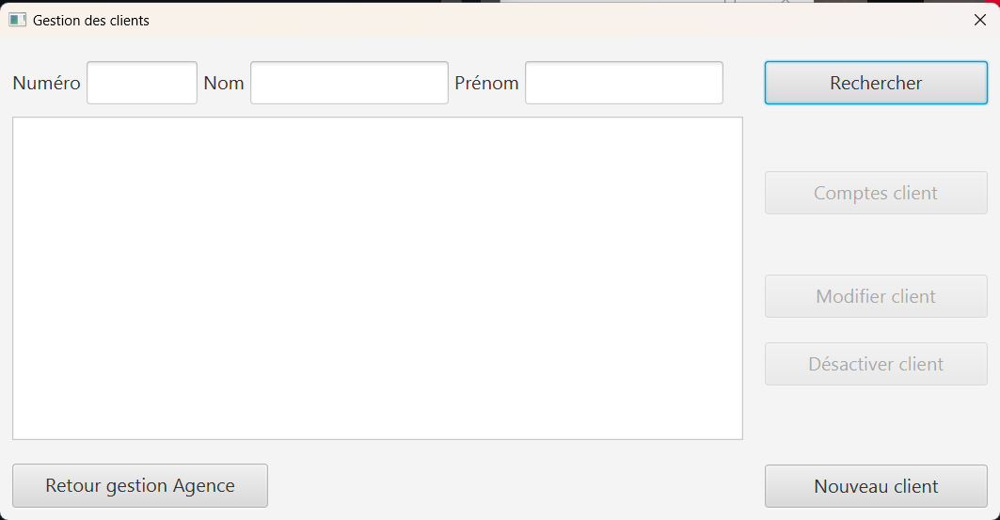

# Document Utilisateur

Equipe:

* Robin Fligitter
* Mathis Brefuel
* Angelo Nichele
* Maxime Planquès

Daily Bank est une application de gestion de finances. Elle permet de gérer tous les services financiers des agences bancaires. 
Ce guide est destiné à tous les utilisateurs de l'application.

## Sommaire:

** Installation
** Configuration
** Utilisation 
  * Rechercher un client
  * Modifier les informations clients
  * Créer un nouveau client
  * Consulter un compte
  * Debiter un compte
  * Rendre inactif un client
** Support

## Installation

Pour installer Daily Bank, suivez les étapes suivantes :

Téléchargez le fichier d'installation depuis notre site web.

https://github.com/IUT-Blagnac/sae2023-bank-4B01/tree/main/LV0/Dev/Code/DailyBank_V0

Double-cliquez sur le fichier téléchargé pour lancer l'installation.

Suivez les instructions à l'écran pour terminer l'installation.

## Configuration

Avant d'utiliser Daily Bank, vous devez configurer votre compte. Voici les étapes à suivre :

1- Veuillez être sûr qu'un compte avec un identifiant et un mot de passe vous a été attribué .(Si ce n'est pas le cas veuillez contacter votre chef d'agence ou les administrateurs de l'application.)

2- Double cliquer sur l'application pour la lancer.

3- Connecter vous via l'identifiant et le mot de de passe qui vous a été attribué.

## Utilisation

Une fois que vous êtes connecté , vous pouvez commencer à utiliser Daily Bank. Voici quelques fonctionnalités de l'application :

### Rechercher un client

Pour commencer la gestion des clients, veuillez cliquer sur l'onglet gestion en haut de la page, puis choisissez Clients.

Vous allez alors trouver cette fenêtre

Rechercher dans la barre en haut via le nom, prenom ou identifiant. 

Pensez à appuyer sur rechercher !

A savoir: vous trouverez seulement les clients de VOTRE Agence.

### Modifier les informations clients

Après avoir rechercher et selectionner d'un clic le client cible.

Appuyer sur le bouton modifier à la droite de l'application.

Vous pourrez alors modifier son Nom, Prénom, adresse, numéro de téléphone ainsi que son e-mail.
L'Identifiant de référence n'est pas modifiable.

Penser à sauvegarder les modification en appuyant sur le bouton MODIFIER.

### Créer un nouveau client

Pour créer un nouveau client, veuillez aller dans l'onglet de gestion des clients.

Cliquez sur Nouveau Client.

Entrer tous les champs.

Ne mettez pas d'espace dans le numéro de téléphone.

L'adresse n'a pas besoin d'être remplie.

Cliquez sur AJOUTER.

### Consulter un compte

Commencez par rechercher un client --> choisissez le client --> Comptes client --> Choisir le compte --> Voir opérations

### Debiter un compte

Commencez par rechercher un client --> choisissez le client --> Comptes client --> Choisir le compte --> Voir opérations --> Enregistrer Débit --> Choisir le type d'Opération --> choisir le montant .

Faites attention au découvert autorisé ( en haut à droite ) et regarder si la le debit est possible en prenant en compte la solde du compte. 

### Rendre inactif un client

Cette fonctionnalité n'est accessible qu'à un chef d'agence.

Si vous êtes chef d'agence vous pourrez modifier le statut d'inactivité du client en modificant les informations clients.

Si vous ne l'êtes pas prenez contact avec le chef de votre agence.

## Support

Si vous rencontrez des problèmes avec Daily Bank, vous pouvez contacter notre équipe de support à l'adresse suivante : support@dailyBank.fr

Nous espérons que vous apprécierez l'utilisation de Daily Bank !
