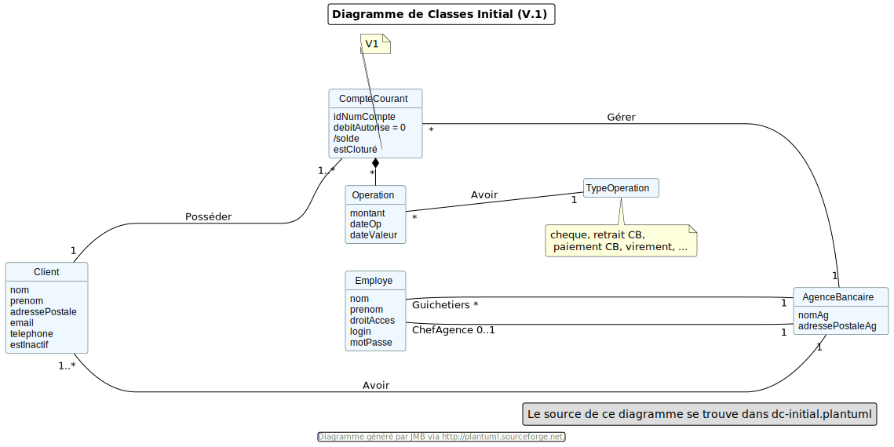

= Document technique de la V1 : Projet DailyBank V1
:toc:
:toc-title: Sommaire

:Entreprise: DailyBank
:Equipe:  

.Groupe 4B01, Auteur : Angelo Nichele, publié le 17/05/2023
Créé pour : Détailler chaques fonctionnalités de la V1 de l'application DailyBank

 

== I. Présentation de l'application
[.text-justify]

L’application Daily Bank est l’outil de gestion de comptes des clients et en raison d’un besoin de restructuration des services      banquaires nous allons développer cette application devenue obsolète. Nous allons alors adapter cette application aux nouveaux besoin de la banque.

=== 1. Cas d'utilisation global
[.text-justify]

La V1 de l'application va permettre au *guichetier* de réaliser les mêmes actions que dans la V0 tout en lui permettant de réaliser de nouvelles actions :

* Créer un compte
* Créditer un compte
* Effectuer un virement de compte à compte
* Clôturer un compte

Le *Chef d'Agence* aura la possibilité de réaliser toutes les actions d'un guichetier et aura désormais la possibilité de *gérer les employés (CRUD)*.

=== 2. Diagramme de classe
[.text-justify]

Voici le diagramme de classe de la base de données de la banque DailyBank

[alt=Diagramme de Classe, title=Base de données de DailyBank]

* ' EMPLOYE ': représente les employés de la banque, qui ont des login et des droits d'accès différents selon si ils sont chef d'agence ou pas (DROITSACCES).
* ' AGENCEBANCAIRE' : represente une agence constitué du nom de l'agence, de son adresse, d'un id et d'un chef d'agence représenté par une ID ( IDEMPLOYECHEFAG ).
* ' CLIENT ' : représente le client avec toutes ses information personnelles ainsi que son agence ( IDAG ) et son statut d'inactivité ( ESTINACTIF ).
* ' COMPTECOURANT ' : représente les comptes avec le numéro du compte, le debit autorisé, la solde, le numéro du client auquel appartient le compte ( IDNUMCLI ), et son statut ( cloturé ou pas -- ESTCLOTURE )
* ' OPERATION ' : représente une operation opéré sur un compte, on y retrouve l'id de celle ci, le montant, la date ( DATEOP et DATEVALEUR ), le numero du compte ainsi que le type d'opération ( IDTYPEOP) 
* ' TYPEOPERATION ' liste tous les type d'OPERATION 
* ' EMMPRUNT ' : represente les informations lors d'un emprunt, comme le un identifiant, le taux, le montant, la durée, le debut et le client.
* ' ASSURANCEEMPRUNT ' : représente l'assurance de l'emprunt avec l'identifiant, le taux, le taux couvert et l'emprunt concerné.
* ' PRELEVEMENTAUTOMATIQUE ' : représente les prelevements automatiques, on y retouve un identifiant, le montant, les dates recurrentes, les benéficiares et le compte prelevé.

== II. Architecture de l'application

=== 1. Structuration des packages
[.text-justify]

Les packages : dans src/main/java

*** application

  ** DailyBank : main() de départ

*** application.control

  ** Contrôleurs de dialogue et accès aux données : gestion des fonctions de l’application. Deux rôles majeurs :

    * Réalise les actions concrètes : accès BD, faire un calcul complexe, générer un fichier, …​

    * Ouvre les autres fenêtres nécessaires : gestion du dialogue.

*** application.view

   ** Contrôleurs associés aux vues fxml.

    * Gestion de la vue affichée : contrôle des saisies réalisées, messages d’erreurs pour les contrôles de surface, appel du contrôleur de dialogue pour réaliser les actions concrètes.

*** application.tools

  ** Utilitaires pour application.view et application.control

*** model.data

  ** Classes java mappant les table de la BD. Une table ⇒ 1 classe. On peut en ajouter (classes pour jointures, …​)

*** model.orm

  ** Classes d’accès physiques à la BD. Une table ⇒ 1 classe offrant différentes méthodes pour accéder à la table : select, insert, delete, update, appel de procédure stockée (elles sont données). On peut en ajouter.

*** model.exception

  ** Classes des exceptions spécifiques d’accès à la BD, levées par les classes de model.orm

Les views fxml : dans src/main/resources.

*** application.view

  ** Vues de l’application : fichiers fxml

  ** Fichier css

=== 2. Rôle de chaque classes dans les packages

*** application

** DailyBank : main() de l’application, permet de lancer l'application ( "runapp()" ).

** DailyBankState : classe de description du contexte courant de l’application : qui est connecté ? est-il chef d’agence ? à quelle agence bancaire appartient-il ?

*** application.control

** Une classe par fenêtre dite contrôleur de dialogue. Exemple LoginDialog

** Rôles de chaque classe :

* A la création : i) construit le Stage java FX de la fenêtre, ii) charge le fichier fxml de la vue et son contrôleur

* Offre une méthode de démarrage du Dialogue, du type doNomClasseControlDialog(...). Exemple doLoginDialog()

* Offre des méthodes d’accès aux données, disponibles pour son contrôleur de vue

* Offre des méthodes d’activation d’autres fenêtres, disponibles pour son contrôleur de vue

* Peut offrir des méthodes de calcul ou autre (accès à des fichiers, …​), disponibles pour son contrôleur de vue

*** application.view

** Une classe par fenêtre dite contrôleur de vue ET un fichier fxml associé. Exemple LoginDialogController et logindialog.fxml

** Un objet d’une telle classe ne connaît de l’application que son contrôleur de dialogue (de application.control)

** Rôles de chaque classe :

* Offre une méthode initContext(...) pour être initialisée. Appelée par le contrôleur de dialogue

* Offre une méthode displayDialog(...) pour afficher la fenêtre. Appelée par le contrôleur de dialogue

* Gère toutes les réactions aux interactions : saisies, boutons, …​

* Met à jour l’interface lorsque de besoin : griser des boutons, remplir des champs, …​

* Effectue tous les contrôles de surface au niveau de la saisie : valeurs remplies, nombres < 0, …​

* Appelle son contrôleur de vue si besoin d’accéder à des données

* Appelle son contrôleur de vue si besoin de lancer une autre fonction (fenêtre) de l’application

*** model.data

** Classes java mappant les table de la BD.

* Une table ⇒ 1 classe. On peut en ajouter (classes pour jointures, …​)

** Servent à échanger les donnes entre model.orm et application.control

** Ces classes ne définissent aucune méthode qui "fait quelque chose" (calcul, …​). Les attributs sont public et une seule méthode toString (). Chaque attribut est un champ de la table.

** Ces classes ne contiennent que les champs de la BD que l’on souhaite remonter vers l’application.

*** model.orm

** Classes d’accès physiques à la BD.

** Une table ⇒ 1 classe offrant différentes méthodes pour accéder à la table : select, insert, delete, update, appel de procédure stockée (elles sont données). On peut en ajouter.

** Chaque classe : effectue une requête SQL, presque la requête qu’on ferait au clavier envoyée au serveur sous forme de String. Ensuite elle emballe le résultat en java (objets de model.data, ArrayList, …​).

A part :

** model.exception : pour ne pas mélanger classes de code et classes d’exception

* A voir sur le code lorsque de besoin.

** application.tools : pour isoler des classes utilisées à plusieurs endroits et qui sont utilitaires par rapport aux objectifs de l’application.

*  A voir sur le code lorsque de besoin

== III. Fonctionnalités de l'application
=== 1. Modifier client

=== 2. Analyse des besoins V1

La V1 de l'application va permettre au *gichetier* de réaliser les mêmes actions que dans la V0 tout en lui permettant de réaliser de nouvelles actions :

* Créer un compte
* Créditer un compte
* Effectuer un virement de compte à compte
* Clôturer un compte

Le *Chef d'Agence* aura la possibilité de réaliser toutes les actions d'un guichetier et aura désormais la possibilité de *gérer les employés (CRUD)*.

=== 3. Analyse des besoins V2

La version 2 de l'application DailyBank permetttra au *gichetier* de réaliser toutes ces actions :

* Générer un relevé mensuel d'un compte en PDF
* Gérer les prélèvements automatiques (CRUD)
* Modifier le plafond d'un compte

Le *chef d'Agence* aura également la possibilité de :

* Simuler un emprunt
* Simuler une assurance d'emprunt
* Effectuer un débit exceptionnel

image::useCaseV2.drawio.svg[]

== IV. Analyse des contraintes

Ce projet comporte des contraintes tant dans l'organisation de l'équipe que techniques :

=== 1. Contraintes Organisationnelles

* Répartir les tâches équitablement
* Respecter les délais de chacune des tâches
* Prévoir des retards sur certaines tâches et réussir à s'adapter
* Communiquer sur l'avancement et les éventuels problèmes rencontrés (GitHub + Discord)
* Respecter le délai de rendu du projet, date butoir le 26/05/2023

=== 2. Contraintes Techniques

* Le rendu du projet doit être un jar
* L'utilisateur doit disposer de la version 17 de java
* Un serveur SQL permettant de stocker la base de données liée au projet

Ces contraintes techniques sont destinées aux auteurs du projet et également à l'utilisateur (client) qui devra disposer des éléments cités ci-dessus.
