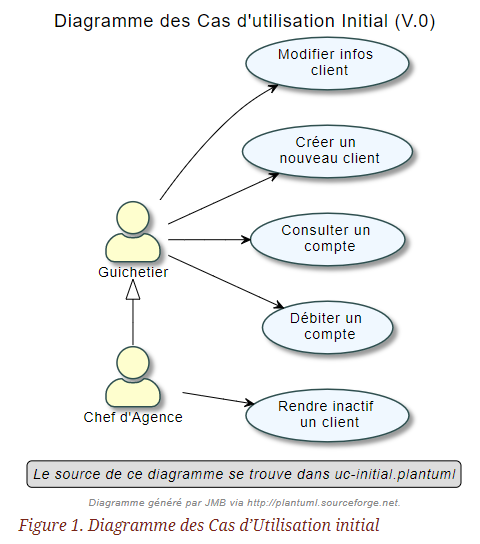

## Cahier des charges du projet DailyBank(V1) Equipe 4B01, 10/05/2023

### Sommaire

* Présentation du sujet
** contexte, objectifs, à quel problème répond-t-il ?
* Analyse de l’existant
* Analyse des besoins incluant V0 et V1
* Analyse des contraintes
** techniques & organisationnelles

'''
## _Présentation du sujet -_

* Contexte
----
La banque DailyBank souhaite développer une application JAVA-Oracle de gestion des comptes
clients pour remplacer plusieurs outils obsolètes. Ce développement s’inscrit dans le cadre 
de la restructuration de ses services bancaires et l’application sera déployée dans les 100
agences que compte son réseau. Vous travaillerez à partir d’une application existante 
« Daily Bank » qu’il faudra adapter aux nouveaux besoins de la banque.
----
* Objectif
----
L’application doit permettre de gérer des comptes bancaires de dépôt pour des clients 
préalablement créés. Elle devra permettre de débiter, créditer un compte soit par virement 
c’est à dire un échange d’argent entre deux comptes distincts mais domiciliés dans le réseau 
bancaire, soit par une personne physique se présentant devant un guichet.
----

## _Version existante -_

Dans la version actuelle de l'application, il existe deux rôles, le *gichetier* et le *chef d'agence*, le gichetier a la possibilité de réaliser les tâches suivantes :

* Modifier des informations client(adresse, téléphone)
* Créer un nouveau client
* Consulter un compte
* Débiter un compte

Le *chef d'agence* peut réaliser toutes ces tâches et peut également *rendre inatif un client*.

## _Analyse des besoins v0_

## _Analyse des besoins v1_

La V1 de l'application va permettre au *gichetier* de réaliser les mêmes actions que dans la V0 tout en lui permettant de réaliser de nouvelles actions :

* Créer un compte
* Créditer un compte
* Effectuer un virement de compte à compte
* Clôturer un compte

Le *Chef d'Agence* aura la possibilité de réaliser toutes les actions d'un guichetier et aura désormais la possibilité de *gérer les employés (CRUD)*.

image::useCaseV1.drawio.svg[]

## _Analyse des contraintes_

Ce projet comporte des contraintes tant dans l'organisation de l'équipe que techniques :

* Organisationnelles

** Répartir les tâches équitablement
** Respecter les délais de chacune des tâches
** Prévoir des retards sur certaines tâches et réussir à s'adapter
** Communiquer sur l'avancement et les éventuels problèmes rencontrés (GitHub + Discord)

* Techniques

Afin de lancer le programme, l'utilisateur devra disposer des éléments suivants :

** La version 17 de java
** Un serveur SQL permettant de stocker la base de données liée au projet
