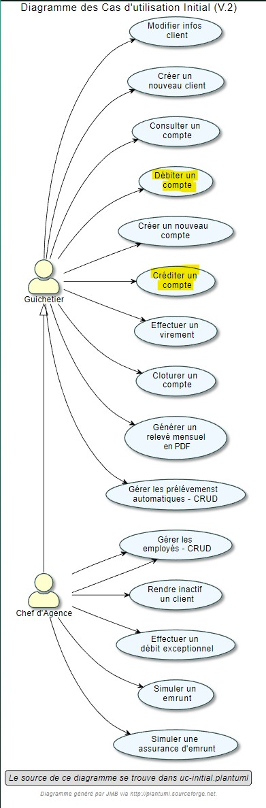
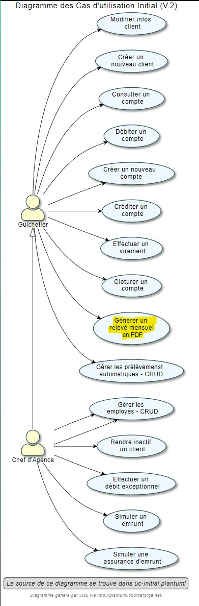
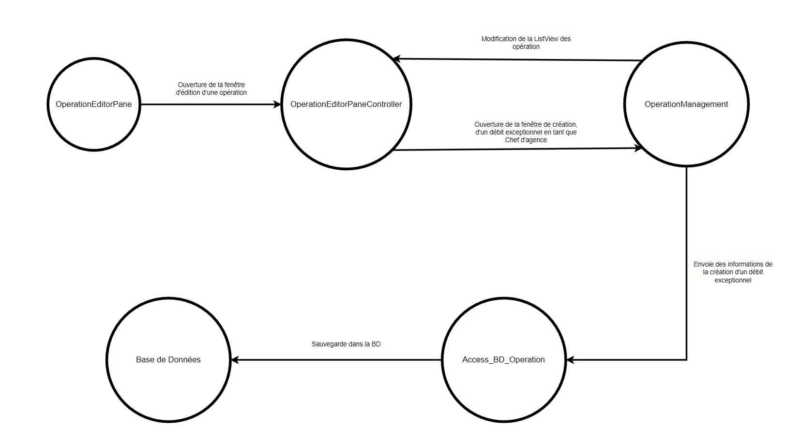

= Document technique de la V2 : Projet DailyBank V2
:toc:
:toc-title: Sommaire

:Entreprise: DailyBank
:Equipe:  

.Groupe 4B01, Auteur : Angelo Nichele, publié le 28/05/2023
Créé pour : Détailler chaques fonctionnalités de la V2 de l'application DailyBank

 

== I. Présentation de l'application
[.text-justify] 
 
L’application Daily Bank est un outil de gestion des clients d'une agence bancaire, de leurs comptes, des opérations présentent sur leurs comptes (créditer / débiter / virement), des prélèments automatiques, et des employés de l'agence bancaire. Dans cette application, nous pouvons aussi faire la simulation d'un emprunt, avec ou sans taux d'assurance, nous pouvons aussi générer un relevé mensuel PDF des comptes d'un client. 

Et en raison d’un besoin de restructuration des services banquaires nous allons développer cette application.

Pour ce faire nous avons 4 collaborateurs, afin de développer cette application :

* *_Mathis Brefuel_*  --- 
** *Développeur* : " _CRUD des employés_ " | " _Effectuer un virement compte à compte_ " | " _Simuler un emprunt_ " | " _Simuler une assurance d'emprunt_ " 

* *_Robin Fligitter_* ---  
** *Développeur* : " _Débit Exceptionnel_ " | " _Simuler une assurance d'emprunt_ " 
** *Rédacteur* : " _Document utilisateur V0 et V1 et V2_ " | " _Document Technique V0_ " | " _Chiffrage du projet_ "

* *_Angelo Nichele_*  --- 
** *Développeur* : " _Créditer et Débiter un compte_ " | " _CRUD des prélèvements automatiques_ " | " _Générer un relevé mensuel PDF_ " 
** *Chef de projet* : " _Gestion du projet sur Github_ " | " _Gestion des tâches à faire_ " 
** *Rédacteur* : " _Document Technique V1 et V2_ " | " _Diagramme de GANTT V1 et V2_ " | " _Cahier de Test V1 et V2_ " | " _Javadoc de toute la V0_ "

* *_Maxime Planquès_* --- 
** *Développeur* : " _Créer compte_ " | " _Modifier compte_ " | " _Clôturer compte_ " | " _Débit Exceptionnel_ "
** *Rédacteur* : " _Cahier des Charges V1 et V2_ " 

=== 1. Description des ressources 
[.text-justify]

*Languages utilisés* : Java 17 

*Outils utilisé* : Scene Builder, Maven

*Framework GUI* : JavaFX

*Base de données* : SQL Developper

*Configuration nécessaire* : Toutes

*IDE* : Eclipse, configurez Eclipse en y installant un plugin pour utiliser du FXML

*Pour accéder au code de l'application, retrouvez le dossier du code dans : https://github.com/IUT-Blagnac/sae2023-bank-4B01/tree/main/LV2/Dev/Code/DailyBank_V2*

*Pour installer l'application finale, veuillez télécharger le fichier JAR : https://github.com/IUT-Blagnac/sae2023-bank-4B01/blob/main/LV2/Dev/JAR_V2/DailyBank-2.0-shaded.jar*

=== 2. Cas d'utilisation global
[.text-justify]

La V2 et version finale de l'application va permettre aux

* Créer un nouveau client
* Modifier informations client
* Consulter un compte
* Créer un compte
* Clôturer un compte
* Débiter un compte
* Créditer un compte
* Effectuer un virement de compte à compte
* Générer un relevé mensuel des comptes d'un client en PDF
* Gérer les prélèvements automatiques

Le *Chef d'Agence* aura la possibilité de réaliser toutes les actions d'un guichetier en plus des actions réservé aux chefs d'agence.

* Actions réservé aux chefs d'Agence :

** Gérer les employés
** Effectuer un débit exceptionnel
** Simuler un emprunt
** Simuler une assurance d’emprunt

[alt=Schéma Use Case, title= Use Case Global de la V2]

=== 3. Diagramme de classe
[.text-justify]

Voici le diagramme de classe de la base de données de la banque DailyBank

[alt=Diagramme de Classe, title=Base de données de DailyBank]

* ' EMPLOYE ': représente les employés de la banque, qui ont des login et des droits d'accès différents selon si ils sont chef d'agence ou pas (DROITSACCES).
* ' AGENCEBANCAIRE' : represente une agence constitué du nom de l'agence, de son adresse, d'un id et d'un chef d'agence représenté par une ID ( IDEMPLOYECHEFAG ).
* ' CLIENT ' : représente le client avec toutes ses information personnelles ainsi que son agence ( IDAG ) et son statut d'inactivité ( ESTINACTIF ).
* ' COMPTECOURANT ' : représente les comptes avec le numéro du compte, le debit autorisé, la solde, le numéro du client auquel appartient le compte ( IDNUMCLI ), et son statut ( cloturé ou pas -- ESTCLOTURE )
* ' OPERATION ' : représente une operation opéré sur un compte, on y retrouve l'id de celle ci, le montant, la date ( DATEOP et DATEVALEUR ), le numero du compte ainsi que le type d'opération ( IDTYPEOP) 
* ' TYPEOPERATION ' liste tous les type d'OPERATION 
* ' EMMPRUNT ' : represente les informations lors d'un emprunt, comme le un identifiant, le taux, le montant, la durée, le debut et le client.
* ' ASSURANCEEMPRUNT ' : représente l'assurance de l'emprunt avec l'identifiant, le taux, le taux couvert et l'emprunt concerné.
* ' PRELEVEMENTAUTOMATIQUE ' : représente les prelevements automatiques, on y retouve un identifiant, le montant, les dates recurrentes, les benéficiares et le compte prelevé.

== II. Architecture de l'application

=== 1. Structuration des packages
[.text-justify]

[alt=Schéma de Architecture de la V2 de l'application, title= Architecture de l'application]

Les packages : dans src/main/java

*** application

  ** DailyBank : main() de départ

*** application.control

  ** Contrôleurs de dialogue et accès aux données : gestion des fonctions de l’application. Deux rôles majeurs :

    * Réalise les actions concrètes : accès BD, faire un calcul complexe, générer un fichier, …​

    * Ouvre les autres fenêtres nécessaires : gestion du dialogue.

*** application.view

   ** Contrôleurs associés aux vues fxml.

    * Gestion de la vue affichée : contrôle des saisies réalisées, messages d’erreurs pour les contrôles de surface, appel du contrôleur de dialogue pour réaliser les actions concrètes.

*** application.tools

  ** Utilitaires pour application.view et application.control

*** model.data

  ** Classes java mappant les table de la BD. Une table ⇒ 1 classe. On peut en ajouter (classes pour jointures, …​)

*** model.orm

  ** Classes d’accès physiques à la BD. Une table ⇒ 1 classe offrant différentes méthodes pour accéder à la table : select, insert, delete, update, appel de procédure stockée (elles sont données). On peut en ajouter.

*** model.exception

  ** Classes des exceptions spécifiques d’accès à la BD, levées par les classes de model.orm

Les views fxml : dans src/main/resources.

*** application.view

  ** Vues de l’application : fichiers fxml

  ** Fichier css

=== 2. Rôle de chaque classes dans les packages

*** application

** DailyBank : main() de l’application, permet de lancer l'application ( "runapp()" ).

** DailyBankState : classe de description du contexte courant de l’application : qui est connecté ? est-il chef d’agence ? à quelle agence bancaire appartient-il ?

*** application.control

** Une classe par fenêtre dite contrôleur de dialogue. Exemple LoginDialog

** Rôles de chaque classe :

* A la création : i) construit le Stage java FX de la fenêtre, ii) charge le fichier fxml de la vue et son contrôleur

* Offre une méthode de démarrage du Dialogue, du type doNomClasseControlDialog(...). Exemple doLoginDialog()

* Offre des méthodes d’accès aux données, disponibles pour son contrôleur de vue

* Offre des méthodes d’activation d’autres fenêtres, disponibles pour son contrôleur de vue

* Peut offrir des méthodes de calcul ou autre (accès à des fichiers, …​), disponibles pour son contrôleur de vue

*** application.view

** Une classe par fenêtre dite contrôleur de vue ET un fichier fxml associé. Exemple LoginDialogController et logindialog.fxml

** Un objet d’une telle classe ne connaît de l’application que son contrôleur de dialogue (de application.control)

** Rôles de chaque classe :

* Offre une méthode initContext(...) pour être initialisée. Appelée par le contrôleur de dialogue

* Offre une méthode displayDialog(...) pour afficher la fenêtre. Appelée par le contrôleur de dialogue

* Gère toutes les réactions aux interactions : saisies, boutons, …​

* Met à jour l’interface lorsque de besoin : griser des boutons, remplir des champs, …​

* Effectue tous les contrôles de surface au niveau de la saisie : valeurs remplies, nombres < 0, …​

* Appelle son contrôleur de vue si besoin d’accéder à des données

* Appelle son contrôleur de vue si besoin de lancer une autre fonction (fenêtre) de l’application

*** model.data

** Classes java mappant les table de la BD.

* Une table ⇒ 1 classe. On peut en ajouter (classes pour jointures, …​)

** Servent à échanger les donnes entre model.orm et application.control

** Ces classes ne définissent aucune méthode qui "fait quelque chose" (calcul, …​). Les attributs sont public et une seule méthode toString (). Chaque attribut est un champ de la table.

** Ces classes ne contiennent que les champs de la BD que l’on souhaite remonter vers l’application.

*** model.orm

** Classes d’accès physiques à la BD.

** Une table ⇒ 1 classe offrant différentes méthodes pour accéder à la table : select, insert, delete, update, appel de procédure stockée (elles sont données). On peut en ajouter.

** Chaque classe : effectue une requête SQL, presque la requête qu’on ferait au clavier envoyée au serveur sous forme de String. Ensuite elle emballe le résultat en java (objets de model.data, ArrayList, …​).

A part :

** model.exception : pour ne pas mélanger classes de code et classes d’exception

* A voir sur le code lorsque de besoin.

** application.tools : pour isoler des classes utilisées à plusieurs endroits et qui sont utilitaires par rapport aux objectifs de l’application.

*  A voir sur le code lorsque de besoin

== III. Fonctionnalités de l'application

=== 1. Créer un nouveau client
==== A. Use Case réalisé
image::Images_DocTechV2/UC-Créer-client.jpg[][alt=Use Case créer client, title=Use Case de créer client]

 
Cette fonctionnalité permet aux guichetiers et aux chefs d'agence de créer un nouveau client dans l'agence. Pour créer un client il faut remplir les champs _Nom_, _Prénom_, _Adresse_, _Téléphone_, _E-Mail_ et _Client Actif ?_ de la fenêtre de création d'un client.

==== B. Partie du diagramme de données nécessaire

Pour pouvoir accéder à la liste des clients, et donc de pouvoir en créer,
nous avons besoin, avant cela, de se connecter en tant que Guichetier ou Chef d'Agence.
Les trois classes utilisées sont donc _Employe_, _AgenceBancaire_ et _Client_.

image::Images_DocTechV2/DC-Créer-client.jpg[][alt=Diagramme de classe créer client, title=Les trois classes nécessaires pour créer un client]

==== C. Classes impliquées dans la fonctionnalité CréerClient

** model.orm/Access-BD-Client.java : Elle permet de faire le lien entre la base de données et la classe _ClientsManagement.java_. Cette fonction se connecte donc à la base de données et y ajoute le client créé.

** application.control/ClientsManagement.java: Elle permet de gérer la fenêtre de création d'un client, c'est-à-dire, créer un nouveau client, l'ajoute à la _ListeView_ afin d'être visible dans la liste des clients de l'agence bancaire. Puis envoie le client
à la classe _Access-BD-Client.java_ afin de le sauvegarder dans la base de données.

** application.view/ClientsManagementController.java: Elle permet de gérer la vue FXML de la création de client (_clienteditorpane.fxml_). Et d'ajouter le client à la fenêtre de la liste des clients (_clientmanagement.fxml_).

** application.control/ClientsEditorPane.java : Elle permet de générer la page de gestion d'un client ( le créer, le modifier ).

** application.view/ClientsEditorPaneController: Elle permet de créer la fenêtre selon le mode choisi (Créer/Modifier).

==== D. Diagramme de séquence de la fonctionnalité CréerClient

image::Images_DocTechV2/DS-Créer-client.jpg[][alt=Diagramme de séquence créer client, title=Diagramme de séquence de CréerClient]

=== 2. Modifier un client
==== A. Use Case réalisé
[alt=Use Case modifier client, title=Use Case de modifier client]

 
Cette fonctionnalité permet aux guichetiers et aux chefs d'agence de modifier un client de l'agence. Pour modifier un client il faut remplir les champs _Nom_, _Prénom_, _Adresse_, _Téléphone_, _E-Mail_ et _Client Actif ?_ de la fenêtre de création d'un client.

==== B. Partie du diagramme de données nécessaire

Pour pouvoir accéder à la liste des clients, et donc de pouvoir en modifier,
nous avons besoin, avant cela, de se connecter en tant que Guichetier ou Chef d'Agence.
Les trois classes utilisées sont donc _Employe_, _AgenceBancaire_ et _Client_.

[alt=Diagramme de classe modifier client, title=Les trois classes nécessaires pour modifier un client]

==== C. Classes impliquées dans la fonctionnalité ModifierClient

** model.orm/Access-BD-Client.java : Elle permet de faire le lien entre la base de données et la classe _ClientsManagement.java_. Cette fonction se connecte donc à la base de données et y ajoute le client créé.

** application.control/ClientsManagement.java: Elle permet de gérer la fenêtre de modification d'un client, c'est-à-dire, modifier un client, l'ajoute à la _ListeView_ afin d'être visible dans la liste des clients de l'agence bancaire. Puis envoie le client modifié
à la classe _Access-BD-Client.java_ afin de le sauvegarder dans la base de données.

** application.view/ClientsManagementController.java: Elle permet de gérer la vue FXML de la modification de client (_clienteditorpane.fxml_). Et d'ajouter le client à la fenêtre de la liste des clients (_clientmanagement.fxml_).

** application.control/ClientsEditorPane.java : Elle permet de générer la page de gestion d'un client ( le créer, le modifier ).

** application.view/ClientsEditorPaneController: Elle permet de créer la fenêtre selon le mode choisi (Créer/Modifier).

==== D. Diagramme de séquence de la fonctionnalité ModifierClient

image::Images_DocTechV2/DS-Modifier-client.jpg[][alt=Diagramme de séquence modifier client, title=Diagramme de séquence de modifierClient]

=== 3. Consulter un compte
==== A. Use Case réalisé
[alt=Use Case consulter compte, title=Use Case de consulter compte]

 
Cette fonctionnalité permet aux guichetiers et aux chefs d'agence de consulter un compte d'un client. Pour consulter un compte il faut sélectionner un client et cliquer sur "Comptes client".

==== B. Partie du diagramme de données nécessaire

Pour pouvoir accéder à un compte d'un client,
nous avons besoin, avant cela, de sélectionner un client.
Les deux classes utilisées sont donc _CompteCourant_ et _Client_.

image::Images_DocTechV2/DC-Consulter-Compte.jpg[][alt=Diagramme de classe consulter compte, title=Les deux classes nécessaires pour consulter le compte d'un client]

==== C. Classes impliquées dans la fonctionnalité ConsulterClient

** application.control/ClientsManagement.java: Elle permet de gérer la fenêtre de des clients, c'est-à-dire, consulter un compte quand on clique sur "Voir Comptes", la fenêtre de gestion des comptes s'ouvre (_comptemanagement.fxml_).

** application.control/ComptesManagement.java: Elle permet de gérer la fenêtre des comptes, notamment de les consulter.

==== D. Diagramme de séquence de la fonctionnalité ConsulterCompte

[alt=Diagramme de séquence consulter compte, title=Diagramme de séquence de consulterCompte]

=== 4. Créer compte (Maxime)
==== A. Use Case réalisé
image::Images_DocTechV2/UC-Créer-Compte.jpg[][alt=Use Case créer compte courant, title=Use Case de créer compte]

 
Cette fonctionnalité permet aux guichetiers et aux chefs d'agence de créer un nouveau compte courant pour un client de l'agence. Pour créer un compte il faut remplir le champ _DébitAutorisé_ et le champ _Solde_ de la fenêtre de création de compte.

==== B. Partie du diagramme de données nécessaire

Pour pouvoir accéder à la liste des comptes d'un client, et donc de pouvoir en créer,
nous avons besoin, avant cela, d'accéder à un client de la base de données.
Les deux classes utilisées sont donc _CompteCourant_ et _Client_.

image::Images_DocTechV2/DC-Créer-Compte.jpg[][alt=Diagramme de classe créer compte courant, title=Les deux classes nécessaires pour créer un compte]

==== C. Classes impliquées dans la fonctionnalité CréerCompte

** model.orm/Access-BD-CompteCourant.java: Elle permet de faire le lien entre la base de données et la classe _ComptesManagement.java_. Cette fonction se connecte donc à la base de données et y ajoute le compte créé.

** application.control/ComptesManagement.java: Elle permet de gérer la fenêtre de création d'un compte client, c'est-à-dire, créer un nouveau compte, l'ajoute à la _ListeView_ afin d'être visible dans la liste des comptes du client. Puis envoie le compte
à la classe _Access-BD-CompteCourant.java_ afin de le sauvegarder dans la base de données.

** application.view/ComptesManagementController.java: Elle permet de gérer la vue FXML de la création de compte (_compteeditorpane.fxml_). Et d'ajouter le compte à la fenêtre de la liste des comptes (_comptemanagement.fxml_).

** application.control/ComptesEditorPane.java : Elle permet de générer la page de gestion d'un compte ( le créer, le modifier, voir les opérations ).

** application.view/ComptesEditorPaneController: Elle permet de créer la fenêtre selon le mode choisi (Créer/Modifier/Supprimer)

==== D. Diagramme de séquence de la fonctionnalité CréerCompte

image::Images_DocTechV2/DS-Créer-Compte.jpg[][alt=Diagramme de séquence créer compte courant, title=Diagramme de séquence de CréerCompte]

=== 5. Clôturer compte (Maxime)
==== A. Use Case réalisé
[alt=Use Case cloturer compte courant, title=Use Case de clôturer compte]

 
Cette fonctionnalité permet aux guichetiers et aux chefs d'agence de clôturer un compte courant d'un client de l'agence. Pour clôturer un compte il faut sélectionner un compte qui a un solde de 0 euro et cliquer sur "Supprimer compte".

==== B. Partie du diagramme de données nécessaire

Pour pouvoir accéder à la liste des comptes d'un client, et donc de pouvoir en clôturer,
nous avons besoin, avant cela, d'accéder à un client de la base de données.
Les deux classes utilisées sont donc _CompteCourant_ et _Client_.

[alt=Diagramme de classe cloturer compte courant, title=Les deux classes nécessaires pour clôturer un compte]

==== C. Classes impliquées dans la fonctionnalité ClôturerCompte

** model.orm/Access-BD-CompteCourant.java: Elle permet de faire le lien entre la base de données et la classe _ComptesManagement.java_. Cette fonction se connecte donc à la base de données et y clôture le compte sélectionné.

** application.control/ComptesManagement.java: Elle permet de clôturer un compte dont le solde est à 0, c'est-à-dire, modifier son étât, "Ouvert" -> "Clôturer". Puis envoie le compte
à la classe _Access-BD-CompteCourant.java_ afin de sauvegarder son étât dans la base de données.

** application.view/ComptesManagementController.java: Elle permet de gérer la vue FXML. Et de modifier l'étât du compte dans la ListView des comptes.

==== D. Diagramme de séquence de la fonctionnalité ClôturerCompte

[alt=Diagramme de séquence cloturer compte courant, title=Diagramme de séquence de ClôturerCompte]

=== 6. Débiter/Créditer (Angelo)
==== A. Use Case réalisé
[alt=Use Case créditer/débiter compte courant, title=Use Case de créditer/débiter compte]

 
Cette fonctionnalité permet aux guichetiers et aux chefs d'agence de débiter et de créditer un compte courant d'un client de l'agence. En cliquant sur voir opérations on a le choix entre faire un débit sur le compte sélectionné (Ouvert) ou un crédit.

==== B. Partie du diagramme de données nécessaire

Pour pouvoir accéder à la liste des comptes d'un client, et donc de pouvoir le débiter/créditer,
nous avons besoin, d'accéder à un client de la base de données et aux opérations faites sur le compte sélectionné.
Les classes utilisées sont donc _CompteCourant_, _Client_, _Operation_ et _TypeOperation_.

image::Images_DocTechV2/DC-Crediter.Debiter-Compte.jpg[][alt=Diagramme de classe débiter/créditer compte courant, title=Les 4 classes nécessaires pour débiter ou créditer un compte]

==== C. Classes impliquées dans la fonctionnalité Créditer/DébiterCompte

** model.orm/Access-BD-Operation.java: Elle permet de faire le lien entre la base de données et la classe _operationsManagement.java_. Cette fonction se connecte donc à la base de données et y ajoute le crédit/débit fait.

** application.control/operationsManagement.java: Elle permet de gérer la fenêtre des opérations sur le compte sélectionné, c'est-à-dire, faire un débit/crédit sur le compte, l'ajoute à la _ListeView_ afin d'être visible dans la liste des opérations du compte. Puis envoie le compte à la classe _Access-BD-Operation.java_ afin de le sauvegarder dans la base de données.

** application.view/OperationsManagementController.java: Elle permet de gérer la vue FXML de la réalisation d'une opération (_operationeditorpane.fxml_). Et d'ajouter l'operation à la fenêtre de la liste des opérations (_operationmanagement.fxml_).

** application.control/OperationsEditorPane.java : Elle permet de générer la page de gestion d'une opération ( débit, crédit, virement ).

** application.view/OperationsEditorPaneController: Elle permet de créer la fenêtre selon le mode choisi (Débiter/Créditer/Virement)

==== D. Diagramme de séquence de la fonctionnalité Débiter/CréditerCompte

[alt=Diagramme de séquence créditer/débiter compte courant, title=Diagramme de séquence de Débiter/CréditerCompte]

=== 7. Virement compte à compte (Mathis)
==== A. Use Case réalisé
[alt=Use Case virement compte à compte, title=Use Case de virement compte à compte]

 
Cette fonctionnalité permet aux guichetiers et aux chefs d'agence d'effectuer un virement compte à compte sur deux comptes courant d'un client de l'agence. En cliquant sur voir opérations on a le choix de faire un virement sur un compte "Ouvert".

==== B. Partie du diagramme de données nécessaire

Pour pouvoir accéder à la liste des comptes d'un client, et donc de pouvoir faire un virement compte à compte,
nous avons besoin, d'accéder à un client de la base de données et aux opérations faites sur le compte sélectionné.
Les classes utilisées sont donc _CompteCourant_, _Client_, _Operation_ et _TypeOperation_.

image::Images_DocTechV2/DC-Virement-Compte.jpg[][alt=Diagramme de classe faire un virement compte à compte, title=Les 4 classes nécessaires pour faire un virement compte à compte]

==== C. Classes impliquées dans la fonctionnalité Virement compte à compte

** model.orm/Access-BD-Operation.java: Elle permet de faire le lien entre la base de données et la classe _operationsManagement.java_. Cette fonction se connecte donc à la base de données et y ajoute le virement compte à compte fait.

** application.control/operationsManagement.java: Elle permet de gérer la fenêtre des opérations sur le compte sélectionné, c'est-à-dire, faire un virement sur le compte, l'ajoute à la _ListeView_ afin d'être visible dans la liste des opérations du compte. Puis envoie le compte à la classe _Access-BD-Operation.java_ afin de le sauvegarder dans la base de données.

** application.view/OperationsManagementController.java: Elle permet de gérer la vue FXML de la réalisation d'une opération (_operationeditorpane.fxml_). Et d'ajouter l'operation à la fenêtre de la liste des opérations (_operationmanagement.fxml_).

** application.control/OperationsEditorPane.java : Elle permet de générer la page de gestion d'une opération ( débit, crédit, virement ).

** application.view/OperationsEditorPaneController: Elle permet de créer la fenêtre selon le mode choisi (Débiter/Créditer/Virement)

==== D. Diagramme de séquence de la fonctionnalité Virement compte à compte

[alt=Diagramme de séquence virement compte à compte, title=Diagramme de séquence de virement compte à compte]

=== 8. Générer relevé PDF (Angelo)
==== A. Use Case réalisé
[alt=Use Case générer relevé PDF, title=Use Case de générer relevé mensuel PDF]

 
Cette fonctionnalité permet aux guichetiers et aux chefs d'agence de générer un relevé mensuel PDF sur les comptes d'un client. En cliquant sur "Générer relevé PDF" sur la fenêtre de gestion des comptes d'un client, un fichier PDF s'ouvre avec les informations des comptes du client.

==== B. Partie du diagramme de données nécessaire

Pour pouvoir accéder à la liste des comptes d'un client, et donc de pouvoir générer un relevé PDF,
nous avons besoin, d'accéder à un client de la base de données et aux comptes de ce client.
Les classes utilisées sont donc _CompteCourant_, _Client_ et _Operation_.

[alt=Diagramme de classe générer relevé PDF, title=Les 3 classes nécessaires pour générer un relevé PDF]

==== C. Classes impliquées dans la fonctionnalité Générer un relevé mensuel PDF

** application.control/ComptesManagement.java: Elle permet de générer un relevé PDF des comptes d'un client en cliquant sur le bouton "Générer relevé PDF", un fichier PDF se télécharge et s'ouvre par la suite.

** application.view/ComptesManagementController.java: Elle permet de gérer la vue FXML. Elle récupère les informations des comptes du client et crée un document PDF ( _doGenererPDF()_ ).

==== D. Diagramme de séquence de la fonctionnalité Générer un relevé mensuel PDF

[alt=Diagramme de séquence générer relevé PDF, title=Diagramme de séquence de générer relevé PDF]

=== 9. CRUD des prélèvements automatiques (Angelo)
==== A. Use Case réalisé
[alt=Use Case gestion prélèvements automatiques, title=Use Case de la gestion des prélèvements automatiques]

 
Cette fonctionnalité permet aux guichetiers et aux chefs d'agence de gérer les prélèvements automatiques des comptes d'un client. En cliquant sur "Voir gestion prélèvements" sur la fenêtre de gestion des comptes d'un client, la fenêtre de gestion des prélèvements automatiques s'ouvre, on peut alors, lire les prélèvements automatiques, les créer, les modifier et les supprimer.

==== B. Partie du diagramme de données nécessaire

Pour pouvoir accéder à la liste des prélèvements d'un client, et donc de pouvoir les gérer,
nous avons besoin, d'accéder à un client de la base de données et enfin aux prélèvements de ces comptes.
Les classes utilisées sont donc _CompteCourant_, _Client_ et _PrelevementAutomatique_.

[alt=Diagramme de classe gestion prélèvements automatiques, title=Les 3 classes nécessaires pour gérer les prélèvements automatiques]

==== C. Classes impliquées dans la fonctionnalité Gérer les prélèvements automatiques

** application.control/ComptesManagement.java: Elle permet d'accèder à la fenêtre de gestion des prélèvements _prelevementmanagement.fxml_ en cliquant sur le bouton "Voir prélèvements" ( _doVoirPrelevement()_ ) .

** model.orm/Access-BD-Prelevement.java: Elle permet de faire le lien entre la base de données et la classe _PrelevementManagement.java_. Cette fonction se connecte donc à la base de données et y ajoute le prélèvement.

** application.control/PrelevementManagement.java: Elle permet de gérer la fenêtre des prélèvements sur les comptes du client, c'est-à-dire, créer, voir, modifier et supprimer un prélèvement, l'ajoute à la _ListeView_ afin d'être visible dans la liste des prélèvements. Puis envoie le prélèvement à la classe _Access-BD-Prelevement.java_ afin de le sauvegarder dans la base de données.

** application.view/PrelevementsManagementController.java: Elle permet de gérer la vue FXML. Et d'ajouter le prélèvement à la fenêtre de la liste des prélèvements (_prelevementmanagement.fxml_).

** application.control/PrelevementsEditorPane.java : Elle permet de générer la page de gestion d'un prélèvement ( créer, modifier ).

** application.view/PrelevementsEditorPaneController: Elle permet de gérer la vue FXML. En effet, elle permet de créer la fenêtre selon le mode choisi (Créer/Modifier).

==== D. Diagramme de séquence de la fonctionnalité Gérer les prélèvements automatiques

[alt=Diagramme de séquence Gérer les prélèvements automatiques, title=Diagramme de séquence de Gérer les prélèvements automatiques]

=== 10. CRUD des employés (Mathis)
==== A. Use Case réalisé
Cette fonctionnalité permet seulement aux chefs d'agence de gérer les employés assignés à leur agence. Cela comporte le droit de créer un nouvel employé, lire les informations d'un employé, le modifier ou le supprimer. 

[alt= UseCase gérer employés, title= UseCase CRUD des employés]

==== B. Partie du diagramme de données nécessaire
Pour pouvoir gérer un employé, nous avons besoin de la connexion d'un chef d'agence ainsi que des informations des employés, accesible via la base de données.
Les classes utilisées sont donc _Employe_, _AgenceBancaire_.

[alt=Diagramme de classe gérer employés, title=Les 2 classes nécessaires pour gérer les employés]

==== C. Classes impliquées dans la fonctionnalité Gérer les Employé

** model.orm/Access-BD-Employe.java: Elle permet de faire le lien entre la base de données et la classe _EmployeManagement.java_. Cette fonction se connecte donc à la base de données et y ajoute l'employé.

** application.control/EmployeManagement.java: Elle permet de gérer la fenêtre des employés de l'agence, c'est-à-dire, créer, voir, modifier et supprimer un employé, l'ajoute à la _ListeView_ afin d'être visible dans la liste des employés. Puis envoie l'employé à la classe _Access-BD-Employe.java_ afin de le sauvegarder dans la base de données.

** application.view/EmployeManagementController.java: Elle permet de gérer la vue FXML. Et d'ajouter/modifier/supprimer l'employé à la fenêtre de la liste des employés (_employemanagement.fxml_).

** application.control/EmployeEditorPane.java : Elle permet de générer la page de gestion d'un employé ( créer, modifier ).

** application.view/EmployeEditorPaneController: Elle permet de gérer la vue FXML. En effet, elle permet de créer la fenêtre selon le mode choisi (Créer/Modifier).

==== D. Diagramme de séquence de la fonctionnalité Gérer les Employé

[alt=Diagramme de séquence Gérer les employés, title=Diagramme de séquence de Gérer les employés]

=== 11. Débit Exceptionnel (Maxime / Robin)
==== A. Use Case réalisé
[alt=Use Case débit exceptionnel, title=Use Case de débit exceptionnel sur un compte]

 
Cette fonctionnalité permet seulement aux chefs d'agence de débiter un compte qui dépasse le découvert du compte en question. En cliquant sur voir opérations on peut faire un débit qui dépasse le découvert du compte en cliquant sur "Effectuer un débit".

==== B. Partie du diagramme de données nécessaire

Pour pouvoir accéder à la liste des comptes d'un client, et donc de pouvoir le débiter,
nous avons besoin, d'accéder à un client de la base de données et aux opérations faites sur le compte sélectionné.
Les classes utilisées sont donc _CompteCourant_, _Client_, _Operation_ et _TypeOperation_.

image::Images_DocTechV2/DC-DebitExceptionnel-Compte.jpg[][alt=Diagramme de classe débit exceptionnel, title=Les 4 classes nécessaires pour débiter exceptionnellement un compte]

==== C. Classes impliquées dans la fonctionnalité Débit Exceptionnel

** model.orm/Access-BD-Operation.java: Elle permet de faire le lien entre la base de données et la classe _operationsManagement.java_. Cette fonction se connecte donc à la base de données et y ajoute le débit exceptionnel.

** application.control/operationsManagement.java: Elle permet de gérer la fenêtre des opérations sur le compte sélectionné, c'est-à-dire, faire un débit exceptionnel sur le compte, l'ajoute à la _ListeView_ afin d'être visible dans la liste des opérations du compte. Puis envoie le compte à la classe _Access-BD-Operation.java_ afin de le sauvegarder dans la base de données.

** application.view/OperationsManagementController.java: Elle permet de gérer la vue FXML de la réalisation d'une opération (_operationeditorpane.fxml_). Et d'ajouter l'operation à la fenêtre de la liste des opérations (_operationmanagement.fxml_).

** application.control/OperationsEditorPane.java : Elle permet de générer la page de gestion d'une opération ( débit, crédit, virement ).

** application.view/OperationsEditorPaneController: Elle permet de créer la fenêtre selon le mode choisi (Débiter/Créditer/Virement)

==== D. Diagramme de séquence de la fonctionnalité Débit Exceptionnel

[alt=Diagramme de séquence debit exceptionnel, title=Diagramme de séquence de débit exceptionnel]

=== 12. Simuler un (une assurance) emprunt (Robin / Mathis)
==== A. Use Case réalisé
[alt=Use Case simuler un emprunt, title=Use Case de simuler un emprunt]

 
Cette fonctionnalité permet seulement aux chefs d'agence de faire une simulation d'emprunt avec ou sans le taux d'assurance. En cliquant sur Simuler Emprunt, le Chef d'agence peut faire une simulation d'emprunt en complétant les différents champs.

==== B. Partie du diagramme de données nécessaire

Pour pouvoir accéder à la liste des clients, et donc de pouvoir simuler un emprunt,
nous avons besoin, de nous connecter à l'agence bancaire en tant que Chef d'agence.
Les classes utilisées sont donc _Employe_, _AgenceBancaire_, _Client_, _Emprunt_ et _AssuranceEmprunt_.

[alt=Diagramme de classe simuler emprunt, title=Les 5 classes nécessaires pour simuler un emprunt]

==== C. Classes impliquées dans la fonctionnalité Simuler Emprunt

** application.control/EmpruntManagement.java: Elle permet de gérer la fenêtre de gestion de la simulation de l'emprunt.

** application.view/EmpruntManagementController.java: Elle permet de gérer la vue FXML de la réalisation d'une simulation d'emprunt. Et de créer une nouvelle fenêtre comportant un _TableView_ avec tous les résultats des calculs de l'emprunt.

==== D. Diagramme de séquence de la fonctionnalité Simuler Emprunt

[alt=Diagramme de séquence simuler emprunt, title=Diagramme de séquence de simuler un emprunt]

