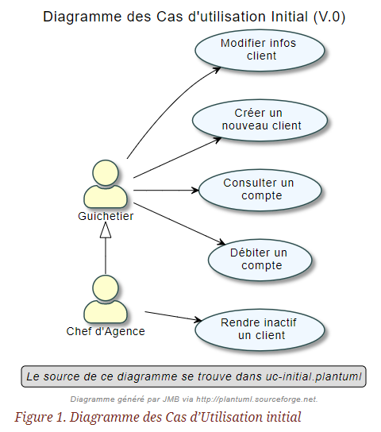
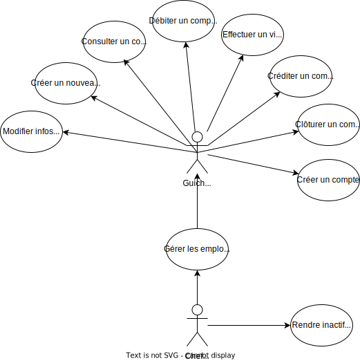

= Cahier des charges utilisateurs V2 : Projet DailyBank
:toc:
:toc-title: Sommaire

:Entreprise: DailyBank
:Equipe:  

.Groupe 4B01, Auteur : Maxime Planquès, publié le 16/05/2023
Créé pour : Détailler la version 2 du projet DailyBank

 

== I. Présentation du sujet
=== 1. Contexte
[.text-justify]
----
La banque DailyBank souhaite développer une application JAVA-Oracle de gestion des comptes
clients pour remplacer plusieurs outils obsolètes. Ce développement s’inscrit dans le cadre 
de la restructuration de ses services bancaires et l’application sera déployée dans les 100
agences que compte son réseau. Vous travaillerez à partir d’une application existante 
« Daily Bank » qu’il faudra adapter aux nouveaux besoins de la banque.
----

=== 2. Objectif
[.text-justify]
----
L’application doit permettre de gérer des comptes bancaires de dépôt pour des clients 
préalablement créés. Elle devra permettre de débiter, créditer un compte soit par virement 
c’est à dire un échange d’argent entre deux comptes distincts mais domiciliés dans le réseau 
bancaire, soit par une personne physique se présentant devant un guichet.
----

== II. Analyse de l'existant
[.text-justify]

Dans la version actuelle de l'application, il existe deux rôles, le *gichetier* et le *chef d'agence*, le gichetier a la possibilité de réaliser les tâches suivantes :

* Modifier des informations client(adresse, téléphone)
* Créer un nouveau client
* Consulter un compte
* Débiter un compte

Le *chef d'agence* peut réaliser toutes ces tâches et peut également *rendre inatif un client*.

== III. Analyse des besoins
=== 1. Analyse des besoins V0

=== 2. Analyse des besoins V1

La V1 de l'application va permettre au *gichetier* de réaliser les mêmes actions que dans la V0 tout en lui permettant de réaliser de nouvelles actions :

* Créer un compte
* Créditer un compte
* Effectuer un virement de compte à compte
* Clôturer un compte

Le *Chef d'Agence* aura la possibilité de réaliser toutes les actions d'un guichetier et aura désormais la possibilité de *gérer les employés (CRUD)*.

=== 3. Analyse des besoins V2

== IV. Analyse des contraintes
=== 1. Contraintes Organisationnelles

=== 2. Contraintes Techniques
