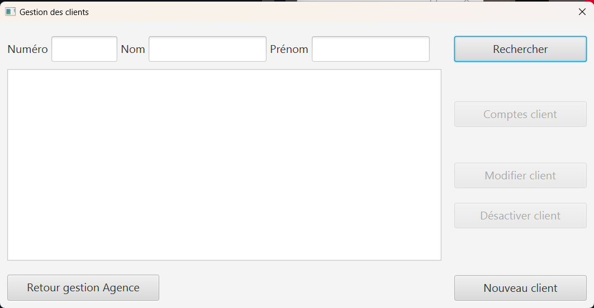
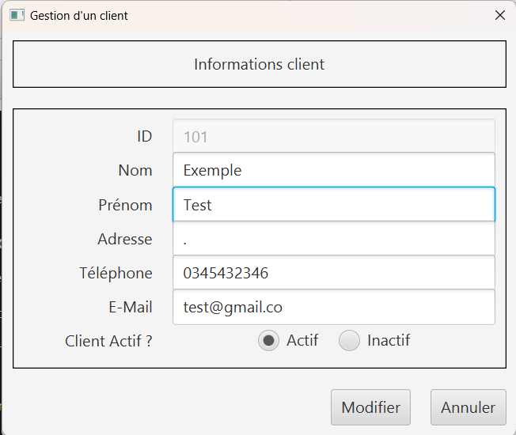
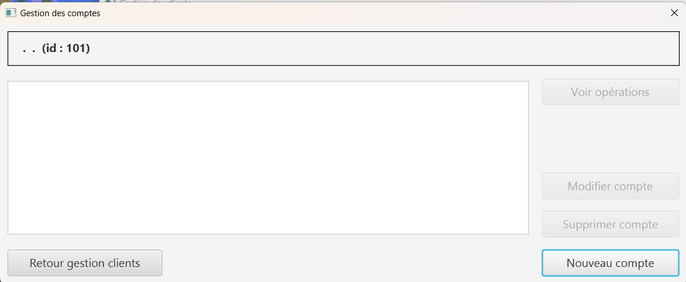
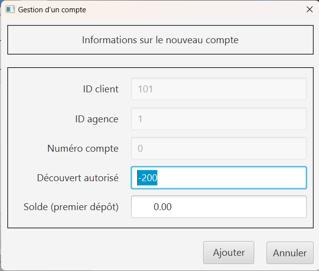
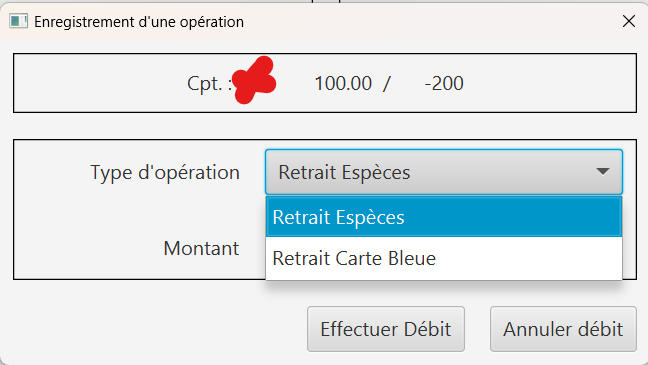

= Document Utilisateur de la V2 : Projet DailyBank V2
:toc:
:toc-title: Sommaire

:Entreprise: DailyBank
:Equipe:  

.Groupe 4B01, Auteur : Fligitter Robin, publié le 26/05/2023
Créé pour : Détailler et guider les utilisateurs dans leurs utilisations de l'application

 

== I. Présentation de l'application
[.text-justify]

L’application Daily Bank est l’outil de gestion de comptes des clients et en raison d’un besoin de restructuration des services banquaires nous allons développer cette application devenue obsolète. Nous allons alors adapter cette application aux nouveaux besoin de la banque.
Pour ce faire nous avons 4 collaborateurs:

* Mathis Brefuel ---

* Robin Fligitter --- Redacteur

* Angelo Nichele ---

* Planquès Maxime --- 

== II. Installation
[.text-justify]

Pour installer Daily Bank, suivez les étapes suivantes :

Téléchargez le fichier d'installation depuis notre site web.

https://github.com/IUT-Blagnac/sae2023-bank-4B01/tree/main/LV0/Dev/Code/DailyBank_V0

Double-cliquez sur le fichier téléchargé pour lancer l'installation.

Suivez les instructions à l'écran pour terminer l'installation.

== III. Configuration
[.text-justify]

Avant d'utiliser Daily Bank, vous devez configurer votre compte. Voici les étapes à suivre :

1- Veuillez être sûr qu'un compte avec un identifiant et un mot de passe vous a été attribué .(Si ce n'est pas le cas veuillez contacter votre chef d'agence ou les administrateurs de l'application.)

2- Double cliquer sur l'application pour la lancer.

3- Connecter vous via l'identifiant et le mot de de passe qui vous a été attribué.

4- Utilisez à votre souhait l'application !

== IV. Gestion des clients
[.text-justify]

Dans cette partie vous retrouverez toute les fonctionnalités liés à la clientèle.

=== 1. Rechercher un client
[.text-justify]

Pour commencer la gestion des clients, veuillez cliquer sur l'onglet gestion en haut de la page, puis choisissez Clients.

Vous allez alors trouver cette fenêtre

Rechercher dans la barre en haut via le nom, prenom ou identifiant. 

Pensez à appuyer sur rechercher !

A savoir: vous trouverez seulement les clients de VOTRE Agence.

=== 2. Modifier les informations clients
[.text-justify]

Après avoir rechercher et selectionner d'un clic le client cible.

Appuyer sur le bouton modifier à la droite de l'application.

Vous pourrez alors modifier son Nom, Prénom, adresse, numéro de téléphone ainsi que son e-mail.
L'Identifiant de référence n'est pas modifiable.

Penser à sauvegarder les modification en appuyant sur le bouton MODIFIER.

=== 3. Créer un nouveau client
[.text-justify]

Pour créer un nouveau client, veuillez aller dans l'onglet de gestion des clients.

Cliquez sur Nouveau Client.

Entrer tous les champs.

Ne mettez pas d'espace dans le numéro de téléphone.

L'adresse n'a pas besoin d'être remplie.

Cliquez sur AJOUTER.

=== 4. Rendre inactif un client
[.text-justify]

Cette fonctionnalité n'est accessible qu'à un chef d'agence.

Si vous êtes chef d'agence vous pourrez modifier le statut d'inactivité du client en modificant les informations clients( IV.3 )

Si vous ne l'êtes pas prenez contact avec le chef de votre agence.

== V. Gestion des comptes
[.text-justify]

Dans cette partie vous retrouverez toute les fonctionnalités liés aux comptes et aux opérations.

=== 1. Consulter un compte
[.text-justify]

Commencez par rechercher un client --> choisissez le client --> Comptes client --> Choisir le compte --> Voir opérations

=== 2. Créer un compte
[.text-justify]

Commencez par rechercher un client --> choisissez le client --> Comptes client --> Nouveau Compte --> Remplir les champs --> Ajouter

      

=== 3. Modifier un Compte
[.text-justify]

Commencez par rechercher un client --> choisissez le client --> Comptes client --> Nouveau Compte --> Remplir les champs --> Ajouter

=== 4. Cloturer un compte
[.text-justify]

Commencez par rechercher un client --> choisissez le client --> Comptes client --> Choisir le Compte --> Supprimer compte

Cloturer un compte ne peut se faire que lorsque sa solde se retrouve à 0.
Le compte sera cloturer et toujours visible mais innaccessible.

CETTE ACTION EST IRRESVERSIBLE.

=== 5. Debiter un compte
[.text-justify]

Commencez par rechercher un client --> choisissez le client --> Comptes client --> Choisir le compte --> Voir opérations --> Enregistrer Débit --> Choisir le type d'Opération --> choisir le montant .

Faites attention au découvert autorisé ( en haut à droite ) et regarder si la le debit est possible en prenant en compte la solde du compte. 

=== 6. Créditer un compte
[.text-justify]

Commencez par rechercher un client --> choisissez le client --> Comptes client --> Choisir le compte --> Voir opérations --> Enregistrer Crédit --> Choisir le type d'Opération --> choisir le montant --> Effectuer crédit

=== 7. Effectuer un virement de compte à compte
[.text-justify]

Commencez par rechercher un client --> choisissez le client --> Comptes client --> Choisir le compte --> Voir opérations --> Enregistrer Virement --> Entrer le numéro de compte du bénéficiaire --> choisir le montant --> Effectuer virement

=== 8. Générer un relevé mensuel d’un compte en PDF
[.text-justify]

Gestion des clients --> Rechercher clients --> Rechercher --> choisir Client --> voir comptes --> Générer relevé PDF

Vous obtiendrez le pdf dans votre navigateur par défault, si vous voulez le télécharger et l'enregistrer sur votre ordinateur, cliquez sur imprimer ( Ctrl + P ) --> destination : Enregistrer au format PDF .

=== 9. Gérer  les prélèvements automatiques
[.text-justify]

Dans cette section, vous verrez les 4 fonctionnalités du prélèvement automatique. La Creation, lecture, modification et suppression des prélèvements automatique.

==== A. Créer des prélèvements automatique
[.text-justify]

Gestion des clients --> Rechercher clients --> Rechercher --> choisir Client --> voir compte --> voir prélèvements --> Nouveau prélèvements --> Saisir Bénéficiaire --> Saisir Montant --> Saisir Date--> Choisir le compte débitaire sur ID Compte  --> Valider.

==== B. Lire des prélèvements automatique
[.text-justify]

Gestion des clients --> Rechercher clients --> Rechercher --> choisir Client --> voir compte --> voir prélèvements --> Saisir Numéro du compte si vous voulez affiner la recherche --> Rechercher

Veuillez rentrez le numéro de compte exact pour affiner la recherche sur 1 compte mais vous pouvez tout aussi bien voir tous les prélevements de tous les comptes du client en laissant el champ du numéro de compte vide

==== C. Modifier des prélèvements automatique
[.text-justify]

Gestion des clients --> Rechercher clients --> Rechercher --> choisir Client --> voir compte --> voir prélèvements --> Saisir Numéro du compte exact --> Rechercher --> Cliquer sur le prélevement automatique --> Modifier --> Changer les informations dans les champs ( Informations valides ) --> Valider

==== D. Supprimer les prélèvements automatique
[.text-justify]

Gestion des clients --> Rechercher clients --> Rechercher --> choisir Client --> voir compte --> voir prélèvements --> Saisir Numéro excat --> Rechercher --> Cliquer sur le prélevement automatique --> Supprimer

=== 10. Effectuer un Débit exceptionnel
[.text-justify]

Cette fonctionnalité est disponible seulement à un chef d'Agence.

Un débit exceptionnel est un débit qui peut se faire malgré une solde qui est en dessous du découvert.

Ce débit est effectué comme un autre débit *par un chef d'agence*

Commencez par rechercher un client --> choisissez le client --> Comptes client --> Choisir le compte --> Voir opérations --> Enregistrer Débit --> Choisir le type d'Opération --> choisir le montant --> Valider --> Message de confirmation --> Confirmer

== VI. Gestion des Employés
[.text-justify]

La gestion des employés est reservé aux chefs d'Agence, les guichetiers n'y ont pas accès !

Pour accéder au menu principal veuillez suivre : Gestion --> Employés

=== 1. Créer un employé
[.text-justify]

Gestion --> Employés -->  Nouveau --> Remplir les champs necessaires --> Valider

=== 2. Lire les employés
[.text-justify]

Gestion --> Employés --> Rechercher dans la barre en haut via le nom, prenom ou identifiant --> bouton Rechercher

Vous pouvez rechercher les employés que de l'agence auquel vous appartenez.
La recherche est possible par nom, prenom ou identifiant

=== 3. Modifier les employés
[.text-justify]

Gestion --> Employés --> Rechercher dans la barre en haut via le nom, prenom ou identifiant --> bouton Rechercher --> Choisir --> Modifier --> Modification des informations--> Valider.

L'identifiant des employés ne peut pas être modifié.

=== 4. Supprimer un employé
[.text-justify] 

Gestion --> Employés --> Rechercher dans la champs en haut via le nom, prenom ou identifiant --> bouton Rechercher --> Choisir --> Supprimer.

== VII. Les Emprunts
[.text-justify]

Dans cette partie vous retrouverez toute les fonctionnalités liés aux simulation d'emprunts et d'assurance d'emprunts 

Cette partie est accessible seulement aux chefs d'agence.

=== 1. Simuler un emprunt
[.text-justify]

Gestion --> Clients --> Simuler Emprunt --> Remplir les champs ( Durée, montant, Taux ) --> Valider.

Si vous rentrez des informations dans les champs qui ne sont pas cohérents ou alors que vous laissez les champs vide les Emprunts en pourront pas être générés.

=== 2. Simuler une assurance d’emprunt
[.text-justify]

Dans le même cas que la simulation d'emprunt vous aurez à chosir lorsque vous rentrez les informations de l'emprunt si vous voulez ajouter uen assurance, le bouton est par défault sur NON.

Gestion --> Clients --> Simuler Emprunt --> Remplir les champs ( Durée, montant, Taux ) --> Cocher OUI sur assurance Emprunt --> Remplir les champs( Taux Assurance ) --> Valider

== VIII.  Support
[.text-justify]

Si vous rencontrez des problèmes avec Daily Bank, vous pouvez contacter notre équipe de support à l'adresse suivante : support@dailyBank.fr

Nous espérons que vous apprécierez l'utilisation de Daily Bank !
