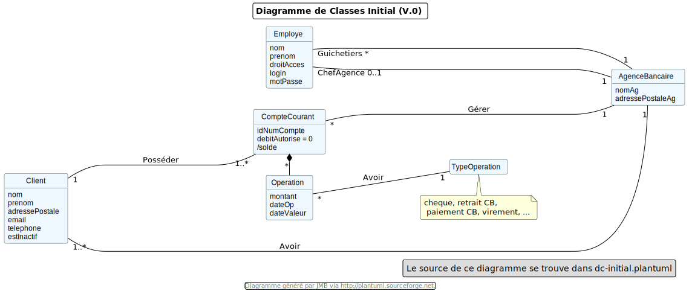

## Cahier des charges du projet DailyBank(V1) Equipe 4B01, 10/05/2023

### Sommaire

* Présentation du sujet
** contexte, objectifs, à quel problème répond-t-il ?
* Analyse de l’existant
* Analyse des besoins incluant V0 et V1
* Analyse des contraintes
** techniques & organisationnelles

'''
## _Présentation du sujet -_

* Contexte
----
La banque DailyBank souhaite développer une application JAVA-Oracle de gestion des comptes
clients pour remplacer plusieurs outils obsolètes. Ce développement s’inscrit dans le cadre 
de la restructuration de ses services bancaires et l’application sera déployée dans les 100
agences que compte son réseau. Vous travaillerez à partir d’une application existante 
« Daily Bank » qu’il faudra adapter aux nouveaux besoins de la banque.
----
* Objectif
----
L’application doit permettre de gérer des comptes bancaires de dépôt pour des clients 
préalablement créés. Elle devra permettre de débiter, créditer un compte soit par virement 
c’est à dire un échange d’argent entre deux comptes distincts mais domiciliés dans le réseau 
bancaire, soit par une personne physique se présentant devant un guichet.
----

## _Version existante -_

Dans la version actuelle de l'application, il existe deux rôles, le *gichetier* et le *chef d'agence*, le gichetier a la possibilité de réaliser les tâches suivantes :

* Modifier des informations client(adresse, téléphone)
* Créer un nouveau client
* Consulter un compte
* Débiter un compte

Le *chef d'agence* peut réaliser toutes ces tâches et peut également *rendre inatif un client*.

